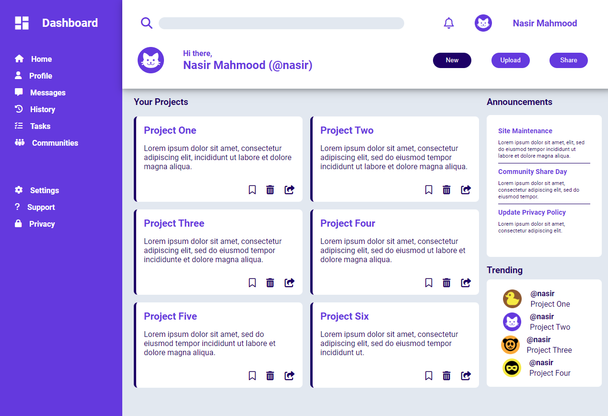

<a name="readme-top"></a>

<div align="center">
  <h1>📖 Admin Dashboard</h>
</div>

 A simple Admin dashboard project that showcases different features of a dashboard. 📚



## 🛠 Built With <a name="built-with"></a>

  <ul>
    <li>HTML</li>
    <li>CSS</li>
  </ul>

<!-- Features -->

### Key Features <a name="key-features"></a>

- [x] **User Profile**
- [x] **Display Announcments**
- [x] **Display Trending**
- [x] **Medium fidelity design**

<p align="right">(<a href="#readme-top">back to top</a>)</p>


<!-- LIVE DEMO -->

## 🚀 Live Demo <a name="live-demo"></a>

- [Live Project Demo](https://nasirkhan294.github.io/admin-dashboard/)

<p align="right">(<a href="#readme-top">back to top</a>)</p>


## Getting Started

To get a local copy up and running, follow these steps.

### Prerequisites
In order to run this project you need:

```
git clone git@github.com:Nasirkhan294/admin-dashboard.git
```

### Deployment

You can deploy this project using **Github-Pages**. In order to make your project live on Github, you'll want to push your updated repo by using these commands:

```
git add --all or git add .

```

```
git commit -m "your commit message"

```

```
git push origin {i.e, your repo name}

```
<p align="right">(<a href="#readme-top">back to top</a>)</p>

<!-- AUTHORS -->

## 👥 Authors <a name="authors"></a>

👤 **Nasirkhan294**

- GitHub: [Nasirkhan294](https://github.com/Nasirkhan294)
- Twitter: [NasirMa35888225](https://twitter.com/NasirMa35888225)
- LinkedIn: [nasirmahd](https://www.linkedin.com/in/nasirmahd/)

<p align="right">(<a href="#readme-top">back to top</a>)</p>

<!-- FUTURE FEATURES -->

## 🔭 Future Features <a name="future-features"></a>

- [ ] **Features  Interactivity**

<p align="right">(<a href="#readme-top">back to top</a>)</p>

<!-- CONTRIBUTING -->

## 🤝 Contributing <a name="contributing"></a>

Contributions, issues, and feature requests are welcome!

Feel free to check the [issues page](../../issues/).

<p align="right">(<a href="#readme-top">back to top</a>)</p>

<!-- SUPPORT -->

## ⭐️ Show your support <a name="support"></a>

Please support this project and be a part of something meaningful and impactful.

<p align="right">(<a href="#readme-top">back to top</a>)</p>

<!-- ACKNOWLEDGEMENTS -->

## 🙏 Acknowledgments <a name="acknowledgements"></a>

I would like to express my sincere gratitude to [The Odin Project](https://www.theodinproject.com/lessons/node-path-intermediate-html-and-css-admin-dashboard) for this design.

<p align="right">(<a href="#readme-top">back to top</a>)</p>

## :question: FAQ <a name="faq"></a>

- **Can I fork and reuse this repository?**

Absolutely! Please feel free to fork and reuse this repository for your own projects.

- **Is it okay to improve this repository? Will my changes be accepted?**

Definitely! We welcome any improvements or new ideas you may have. If your changes are good and align with the project's goals, we would be happy to accept them.


<p align="right">(<a href="#readme-top">back to top</a>)</p>

<!-- LICENSE -->

## 📝 License <a name="license"></a>

This project is [MIT](./LICENSE) licensed.

<p align="right">(<a href="#readme-top">back to top</a>)</p>